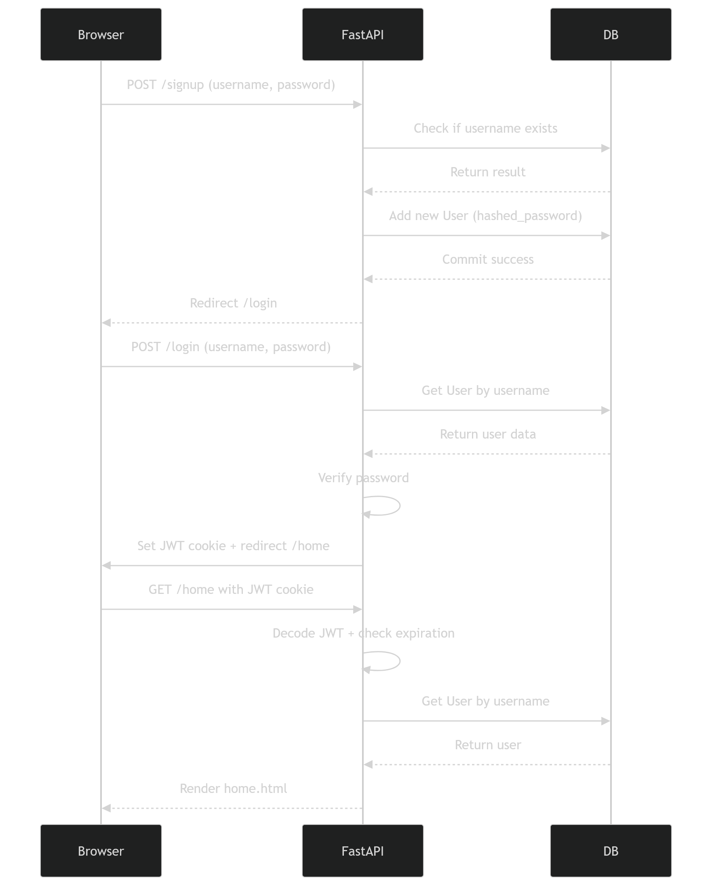

# 📄 FastAPI JWT Authentication Project Documentation

## 1 Project Overview

This project is a **full-featured authentication system** built using **FastAPI**, **SQLAlchemy**, **SQLite**, **JWT**, and **Argon2 password hashing**. It demonstrates secure signup, login, logout, and protected routes using HTTP-only cookies.

**Key Features:**

* 🔐 Secure password hashing with Argon2
* 🎫 JWT-based authentication
* 🍪 HTTP-only cookies to store JWT tokens
* 🛡 Protected routes
* 🔁 Automatic redirect to login for unauthenticated users
* 📝 Signup / Login / Logout functionality
* 🖥 Basic HTML templates with Jinja2

---

## 2 Technology Stack

| Component             | Purpose                                      |
| --------------------- | -------------------------------------------- |
| **FastAPI**           | Web framework for building APIs and web apps |
| **SQLAlchemy**        | ORM for database modeling                    |
| **SQLite**            | Lightweight relational database              |
| **Pydantic**          | Request and response validation              |
| **Argon2 (passlib)**  | Password hashing                             |
| **JWT (python-jose)** | JSON Web Token authentication                |
| **Jinja2**            | HTML templating engine                       |
| **python-multipart**  | Form data parsing                            |

---

## 3 Project Structure

```
fastapi_auth_app/
│
├── main.py                 # Entry point for FastAPI app
├── database.py             # Database setup (SQLAlchemy)
├── models.py               # Database models (User)
├── schemas.py              # Pydantic schemas
├── auth.py                 # JWT creation, verification, password hashing
├── requirements.txt        # Project dependencies
│
├── routers/
│   └── auth_routes.py      # Routes for signup, login, logout, home
│
└── templates/
    ├── signup.html         # Signup page
    ├── login.html          # Login page
    └── home.html           # Protected home page
```

---

## 4️ Installation

1. Clone or copy the project folder.
2. Create a virtual environment (recommended):

### Windows:

```bash
python -m venv venv
venv\Scripts\activate
```

### Mac/Linux:

```bash
python3 -m venv venv
source venv/bin/activate
```

3. Install dependencies:

```bash
pip install -r requirements.txt
```

---

# 5 🏗 Project Architecture & Data Flow

This section explains **how data flows from the client (browser) to the server and database**, and how JWT is used to secure the protected routes.

---

## Overall Architecture

```
+-------------------+         HTTP Requests         +-------------------+
|                   | <--------------------------> |                   |
|      Browser      |                               |     FastAPI       |
|  (User Interface) |                               |   Backend API     |
|                   |         JWT in Cookie        |                   |
+-------------------+                               +-------------------+
         |                                                   |
         | Form submission (POST /signup or /login)         |
         |                                                   |
         v                                                   v
+-------------------+                               +-------------------+
|   Jinja2 Template |                               |  Authentication   |
| (login/signup/home)|                               |  & JWT Handling  |
+-------------------+                               +-------------------+
         |                                                   |
         | Render HTML with user data                        |
         |                                                   |
         v                                                   v
+-------------------+                               +-------------------+
|    SQLite DB      | <-------- SQLAlchemy ORM ---- |  Models & Schemas |
+-------------------+                               +-------------------+
```

---
### Project Screenshots


## Detailed Data Flow for Signup

1. **User submits signup form** on `/signup` page:

```html
<form method="post">
  <input name="username">
  <input name="password">
</form>
```

2. **FastAPI receives POST /signup** in `auth_routes.py`.
3. Server checks **if username already exists**:

```python
existing_user = db.query(User).filter(User.username == username).first()
```

4. **Password is hashed** using Argon2:

```python
hashed_password = hash_password(password)
```

5. **New user is created** in SQLite via SQLAlchemy:

```python
new_user = User(username=username, hashed_password=hashed_password)
db.add(new_user)
db.commit()
```

6. **User redirected to login page**.

---

## Detailed Data Flow for Login

1. **User submits login form** on `/login` page.
2. FastAPI receives **POST /login**.
3. Server retrieves user from DB:

```python
user = db.query(User).filter(User.username == username).first()
```

4. **Password verification** using Argon2:

```python
verify_password(input_password, user.hashed_password)
```

5. **JWT token is created**:

```python
token = create_access_token({"sub": user.username})
```

6. **Token is stored in HTTP-only cookie**:

```python
response.set_cookie(key="access_token", value=token, httponly=True)
```

7. User is **redirected to `/home`**, protected page.

---

## Data Flow for Protected Route (`/home`)

1. Browser sends **GET /home** with **access_token cookie**.
2. FastAPI dependency `get_current_user` executes:

```python
token = request.cookies.get("access_token")
payload = jwt.decode(token, SECRET_KEY, algorithms=[ALGORITHM])
```

3. Server extracts **username from token**:

```python
username = payload.get("sub")
```

4. Server queries database for user:

```python
user = db.query(User).filter(User.username == username).first()
```

5. If valid:

   * Renders `home.html` template with user data.
6. If invalid or expired:

   * Redirects to `/login`.

---

## Data Flow for Logout

1. Browser requests `/logout`.
2. Server deletes `access_token` cookie:

```python
response.delete_cookie("access_token")
```

3. User redirected to `/login`.
4. Future requests to protected routes fail until login again.

---

## JWT Lifecycle

| Step       | Description                                                        |
| ---------- | ------------------------------------------------------------------ |
| **Create** | Server generates token after successful login (`sub=username`)     |
| **Store**  | Token sent to browser in **HTTP-only cookie**                      |
| **Verify** | Each protected request decodes JWT and checks `exp` (expiration)   |
| **Expire** | After token expires, server rejects request and redirects to login |
| **Delete** | Logout clears cookie on client                                     |

---

## Sequence Diagram



---

## Security Measures

1. **Password Hashing** – Argon2 ensures plain passwords are never stored.
2. **JWT Signing** – SECRET_KEY ensures tokens are tamper-proof.
3. **Token Expiration** – prevents old tokens from being used.
4. **HTTP-only Cookies** – prevents JS access (protects against XSS).
5. **Redirects for Unauthorized Access** – ensures protected routes are secure.

---

## Optional Improvements

* **Refresh Tokens**: Keep sessions active without re-login.
* **Role-based Access**: Admin vs normal users.
* **Session Expiry Warning**: Notify users before token expires.
* **API-only Version**: For mobile or SPA frontends.

---

## 6 Database Setup

* Uses **SQLite** for simplicity (`test.db`)
* Table `users` is automatically created using SQLAlchemy:

```python
Base.metadata.create_all(bind=engine)
```

* `User` model:

```python
class User(Base):
    __tablename__ = "users"
    id = Column(Integer, primary_key=True, index=True)
    username = Column(String, unique=True, index=True)
    hashed_password = Column(String)
```

> **Note:** If you change the model, delete `test.db` to recreate tables.

---

## 7 Authentication System

### 7.1 Password Hashing

* **Argon2** algorithm via `passlib`:

```python
pwd_context = CryptContext(schemes=["argon2"], deprecated="auto")

def hash_password(password: str):
    return pwd_context.hash(password)

def verify_password(plain, hashed):
    return pwd_context.verify(plain, hashed)
```

### 7.2 JWT Token

* Created when a user logs in:

```python
def create_access_token(data: dict):
    to_encode = data.copy()
    expire = datetime.utcnow() + timedelta(minutes=ACCESS_TOKEN_EXPIRE_MINUTES)
    to_encode.update({"exp": expire})
    return jwt.encode(to_encode, SECRET_KEY, algorithm=ALGORITHM)
```

* `SECRET_KEY` is **used to sign the token**.
* Token stored in HTTP-only cookie.

---

## 8 Routes (`auth_routes.py`)

| Route     | Method   | Description                           |
| --------- | -------- | ------------------------------------- |
| `/signup` | GET/POST | Render signup form / create user      |
| `/login`  | GET/POST | Render login form / authenticate user |
| `/home`   | GET      | Protected page, requires valid JWT    |
| `/logout` | GET      | Delete cookie and redirect to login   |

**Protected route example:**

```python
@router.get("/home", response_class=HTMLResponse)
def home(request: Request, user: User = Depends(get_current_user)):
    if isinstance(user, RedirectResponse):
        return user
    return templates.TemplateResponse("home.html", {"request": request, "user": user})
```

---

## 9 Templates

* `signup.html` → form to register
* `login.html` → form to login
* `home.html` → shows logged-in username, protected page

> Templates use **Jinja2** for dynamic rendering.

---

## 10 JWT Expiration (Time Limit)

* Default: 60 minutes

```python
ACCESS_TOKEN_EXPIRE_MINUTES = 60
```

* For testing, you can reduce:

```python
ACCESS_TOKEN_EXPIRE_MINUTES = 0.1  # 6 seconds
```

* After expiry, `/home` redirects to login.

---

## 11 Running the Project

From project root:

```bash
python -m uvicorn main:app --reload
```

Visit:

```
http://127.0.0.1:8000/signup
```

---

## 12 Security Notes

1. **SECRET_KEY** must be **kept secret**, used to sign JWT tokens.
2. **HTTP-only cookie** prevents JavaScript access to token.
3. **Argon2 hashing** ensures passwords are secure.
4. **JWT Expiry** prevents old tokens from being reused.
5. Always delete the old SQLite database when changing models.

---

## 13 Testing Flow

1. Visit `/signup` → create account
2. Visit `/login` → authenticate
3. Visit `/home` → access protected page
4. Logout → cookie deleted → redirected to `/login`
5. Test expiration → wait for token to expire → refresh `/home` → redirected to login

---

## 14 Next Steps / Improvements

* Add **refresh tokens**
* Add **role-based access** (admin/user)
* Deploy to **cloud platforms** (Render, Railway)
* Use **PostgreSQL** instead of SQLite for production
* Add **Bootstrap** or **Tailwind** for better UI
* Add **API-only version** for React/Next.js frontend

---

## 15 References

* [FastAPI Official Docs](https://fastapi.tiangolo.com/)
* [SQLAlchemy ORM Docs](https://docs.sqlalchemy.org/en/20/orm/)
* [Passlib – Password Hashing](https://passlib.readthedocs.io/en/stable/)
* [python-jose – JWT](https://python-jose.readthedocs.io/en/latest/)
* [Jinja2 Templates](https://jinja.palletsprojects.com/en/3.1.x/)

---
